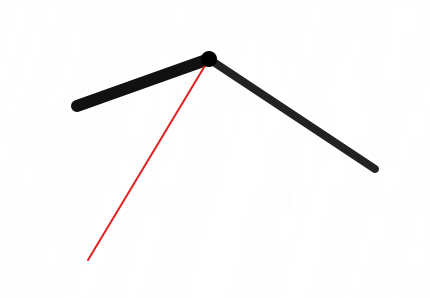

# Lazy Clock

> A minimal desktop clock – always visible, always movable.

## 💻 Project Run
- Open with Python: [Lazy_Clock.py](Lazy_Clock.py.py)
  
- Or download exe: [Lazy_Clock.exe](https://github.com/NebulaStack-prog/Friday-13-I/releases/tag/v1.0)

## 📄 Full Documentation
- 🇷🇺  Russian version: [Documentation](LazyClock_RU.md)
  
- 🇺🇲  English version: [Documentation](LazyClock_EN.md)

## 📷 Screenshots:

© NebulaStack
